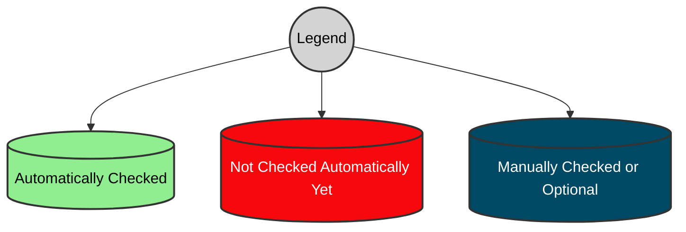
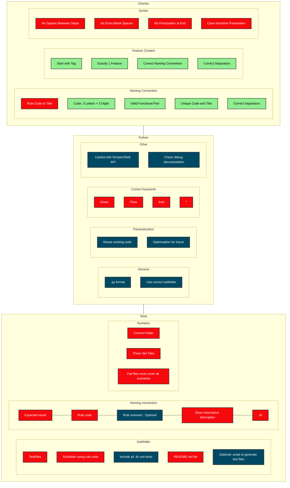

```mermaid
graph TB;

    %% Class Definitions
    classDef green fill:#90EE90,stroke:#333,stroke-width:2px, color:black;
    classDef red fill:#F5090D,stroke:#333,stroke-width:2px, color:white;
    classDef blue fill:#004964,stroke:#333,stroke-width:2px, color:white;
    classDef legend fill:#D3D3D3,stroke:#333,stroke-width:2px, color:black;

    %% Legend
    L((Legend)) --> A[(Automatically Checked)]
    L --> B[(Not Checked Automatically Yet)]
    L --> C[(Manually Checked or Optional)]

    class L legend
    class A green
    class B red
    class C blue

```

```mermaid
graph TB
    classDef green fill:#90EE90,stroke:#333,stroke-width:2px, color:black;
    classDef red fill:#F5090D,stroke:#333,stroke-width:2px, color:white;
    classDef blue fill:#004964,stroke:#333,stroke-width:2px, color:white;
    subgraph Gherkin
        subgraph Naming Convention
            A[Rule Code to Title]:::red
            B[Code: 3 Letters + 3 Digits]:::green
            C[Valid Functional Part]:::green
            D[Unique Code and Title]:::green
            E[Correct Separators]:::green
        end
        subgraph Feature Content
            F[Start with Tag]:::green
            G[Exactly 1 Feature]:::green
            H[Correct Naming Convention]:::green
            I[Correct Separators]:::green
        end
        subgraph Syntax
            J[No Spaces Between Steps]:::red
            K[No Extra Blank Spaces]:::red
            L[No Punctuation at End]:::red
            M[Case-Sensitive Parameters]:::red
        end
    end
    subgraph Python
        subgraph General
            BB[.py format]:::blue
            BC[Use correct subfolder]:::blue
        end
        subgraph Parametisation
            BD[Reuse existing code]:::blue
            BE[Optimisation for future]:::blue
        end
        subgraph Correct Keywords
            BF[Given]:::red
            BG[Then]:::red
            BH[And]:::red
            BI[*]:::red
        end
        subgraph Other
            BJ[Careful with IfcOpenShell API]:::blue
            BK[Check debug documentation]:::blue
        end
    end
    subgraph Tests
        subgraph Subfolder
            CA[Test/files]:::red
            CB[Subfolder using rule code]:::red
            CH[Include all .ifc unit tests]:::blue
            CI[README.md file]:::red
            CJ[Optional: script to generate test files]:::blue
        end
        subgraph Naming convention
            direction RL
            CG[.ifc]:::red
            CF[Short informative description]:::red
            CE[Rule scenario : Optional]:::blue
            CD[Rule code]:::red
            CC[Expected result]:::red
        end
        subgraph Numbers
            direction RL
            CZ[At least 1 pass file]:::red
            CX[At least 3 fail files]:::red
            CR[Fail files must cover all scenarios]:::red
        end
        CG --- CF
        CF --- CE
        CE --- CD
        CD --- CC
        CZ[Correct Folder]
        CX[Three 'fail' Files]
    end
    Gherkin --- Python
    Python --- Tests


```
